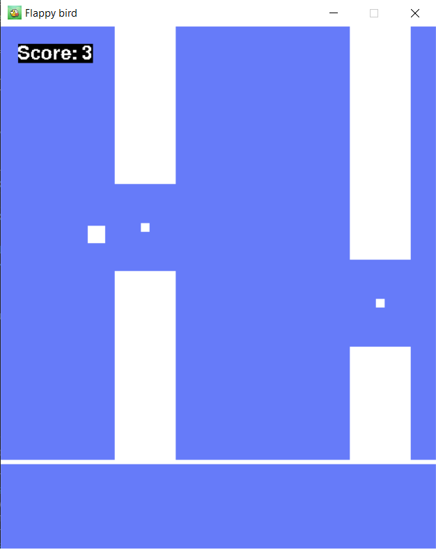

[python-download]: https://www.python.org/downloads/
 

<p align="center">
	
</p>


Flappy Bird is an arcade-style game in which the player controls the bird Faby, which moves persistently to the right. The player is tasked with navigating Faby through pairs of pipes that have equally sized gaps placed at random heights. Faby automatically descends and only ascends when the player taps the SPACE key. Each successful pass through a pair of pipes awards the player gets one point. Colliding with a pipe or the ground ends the gameplay. 

### Built with

- [Pygame](https://www.pygame.org/news)


## :hammer: Getting started

### Pre requisites

- [Python][python-download] - 3.9 or up


### Installation

#### Pipfile and Pipfile.Lock

Inside the Pipfile there's all the modules name needed for the project. 

1. Download Pipenv through the terminal window ***(make sure you have [Python][python-download] installed)***:

	```python
    pip install pipenv
    ```
    
2. After installing pipenv all you have to do is to download the files and in the terminal window, go to the folder with these files and run:

	```python
    pipenv install
    ```
    This will create a virtual environment with the module `pygame`.

3. We must have this virtual environment to run our program, through the terminal window:

	```python
    pipenv shell # To run the virtual environment
    exit         # To close the virtual environment
    ```

If any doubts here's a link to some more explanations: [Pipenv](https://pipenv-fork.readthedocs.io/en/latest/basics.html)


## :video_game: Play the game

- Download the project, open the terminal window on folder with '**flappy_bird_1.py**' and type:

```
python flappy_bird_1.py
```

Enjoy the game :smiley:

I am making two versions of this game, one using only rectangles, and other with images.
Currently the one you can play is with rectangles.

